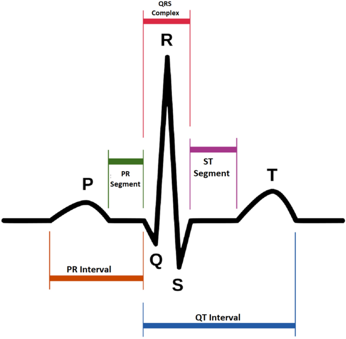
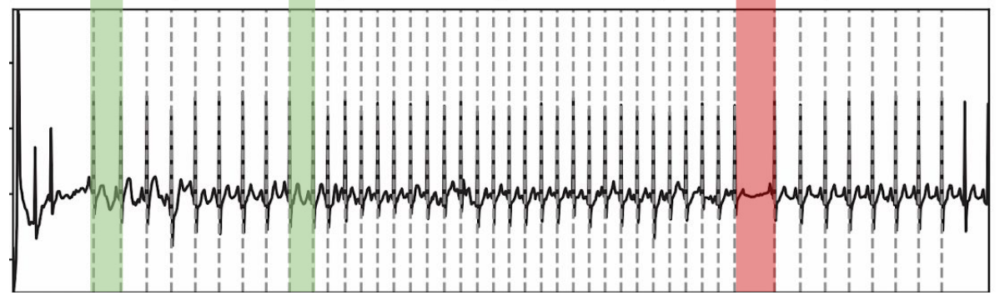
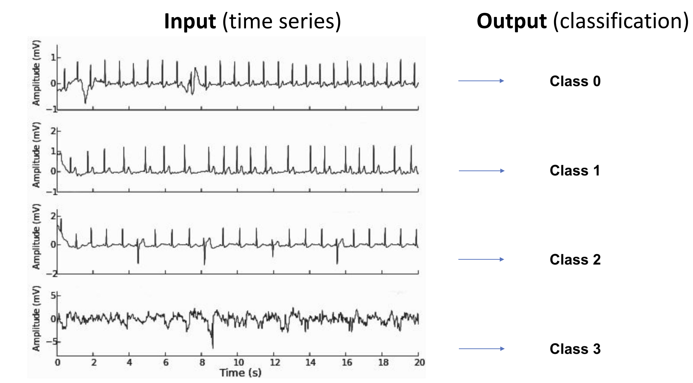

# ❤️ Heart Rhythm Classification from Raw ECG Signals

This project involves classifying heart rhythms based on raw ECG signals. The goal is to develop a machine learning model capable of distinguishing between different rhythm classes using time-series ECG data.

---

## 📁 Dataset Description

The dataset consists of the following files:

- **train.csv**: Labeled ECG signals for training.
- **test.csv**: Unlabeled ECG signals for testing.
- **sample_submission.csv**: A template for submission format.

Each row represents an ECG signal with up to **17,807** data points (sampled at **300 Hz**). Due to varying signal lengths, some values are padded with `NaN`, which can be safely ignored.

---

## 🫀 ECG Signal Structure

The ECG (electrocardiogram) signal records the electrical activity of the heart and includes several characteristic waveforms:

- **P wave**: Atrial depolarization
- **QRS complex**: Ventricular depolarization
- **T wave**: Ventricular repolarization

These features help in identifying different heart conditions when extracted and analyzed properly.

---

## 🔍 Feature Extraction

Each ECG signal is segmented into individual **heartbeat templates**, typically using peak detection and signal processing libraries.

We use the **`biosppy`** library to extract meaningful features from each signal, such as:

- Peak intervals (RR intervals)
- Amplitude of QRS complex
- Signal shape and slopes
- Time-domain and frequency-domain features

---

## 🧠 Model Overview

We train a classifier that predicts one of **four classes** based on the extracted features:

- **Class 0** – Normal
- **Class 1** – Rhythm Type A
- **Class 2** – Rhythm Type B
- **Class 3** – Noisy or unclear signal

### Example Data and Classification Output:

---

## 📊 Evaluation Metric

The primary evaluation metric is the **F1 Score (micro-averaged)**, which balances **precision** and **recall**:

**Formula**:

F1 = 2 * (precision * recall) / (precision + recall)
📤 Submission Format
Submit predictions to Kaggle in the following format:

python-repl
Copy
Edit
id,y
0,2
1,0
2,2
...
id: ID of the test sample

y: Predicted class (0, 1, 2, or 3)
## 🛠️ Technologies Used

- **Python** – Core programming language for data processing and modeling
- **NumPy** & **Pandas** – Efficient numerical computations and data manipulation
- **biosppy** – For ECG signal processing and heartbeat template extraction
- **SciPy** & **scikit-learn** – Signal analysis and machine learning algorithms
- **Matplotlib** / **Seaborn** – For visualizing ECG signals and model results
- *(Optional)* **TensorFlow** / **PyTorch** – For implementing deep learning models

---

## 🚀 Future Work

- Implement deep learning models such as **CNNs** and **LSTMs** on raw ECG signals
- Develop a **real-time heart rhythm monitoring system**
- Integrate the solution with **wearable medical devices** for continuous health tracking
